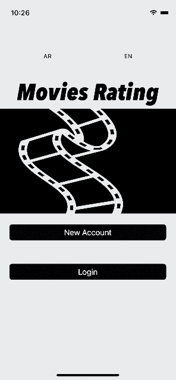
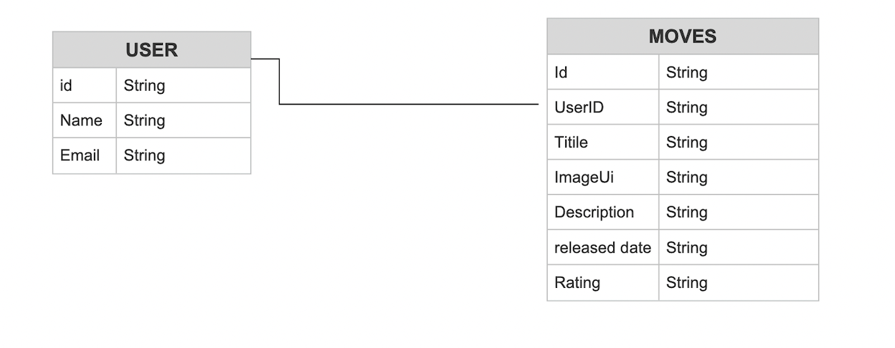

# RatingShow

## Description
This app is to show the daily raiting using API to Provide the updating of movie rating 

- What was the motivation?
The big motivited was if I could bulid this app with out of no big mistakes than I will be able to update the contant and push it to apple store esaily 

- Why did you build this project? 

It was in idea that to see new movies .. but I dont have time to chack to all movies to know the best and the last movie poping ..!!

- What problem does it solve?

the time of founding the best and highest raiting movie i think one of iportent futeauer that we need in future will be more easiest to just click and run your best move on the app 

- What did I learn?

I learn from this app as "user "that I could found the best movie 
but I learn as develper how to cearate application for what user need !

## Demo

## usre stories:

- as user I can make register & loge in.
- user can add move rating .
- user can edit his "Rating for the move " and delete
- ueser can update his move rating 
- user can see all the other move rating that has been published by othe painter,without access of "update & delete".
as a user I can see my result in Arabic,English

**########## The Features and API ###############
**
The features of this app is using API that show the update of raiting movies.
for this version 1.0

for next version 1.1  the user will be able to see movie trailers ot the same view controller or spraite.

## Framework
- UIKit
- Firebase
- Api service
- IQKeyboardManagerSwift

## ERD
​

